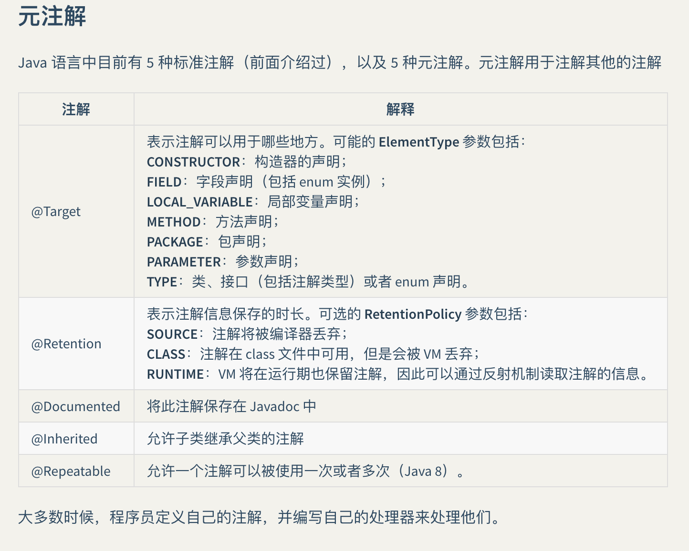

#注解(元数据):
是在源代码中，class文件中，运行时提供一种信息辅助编程;这些信息可以定义在类中的任何地方;
不能继承及其注解;

## jdk中5种注解，前3种定义在java.lang包中:

## 元注解:
用于注解其他的注解;

Retention元注解使用范围:
    1.SOURCE: 在源代码中;
    2.CLASS: 在编译后的class文件中;
    3.RUNTIME: 在运行时;
    
## 注解元素：
注解中定义的方法;
元素可用类型:
    1.基本类型;
    2.String;
    3.Class;
    4.enum;
    5.Annotation;
    6.以上类型的数组;
元素默认值:
    元素不能有不确定值，不能使用null作为其值。可用空字符串或者负数表达某个元素不存在;

