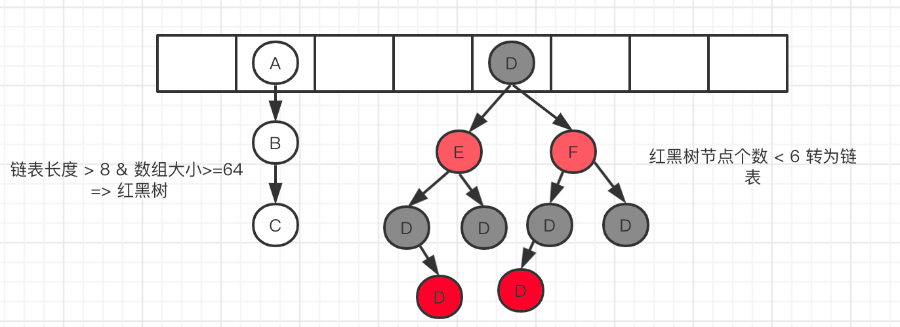
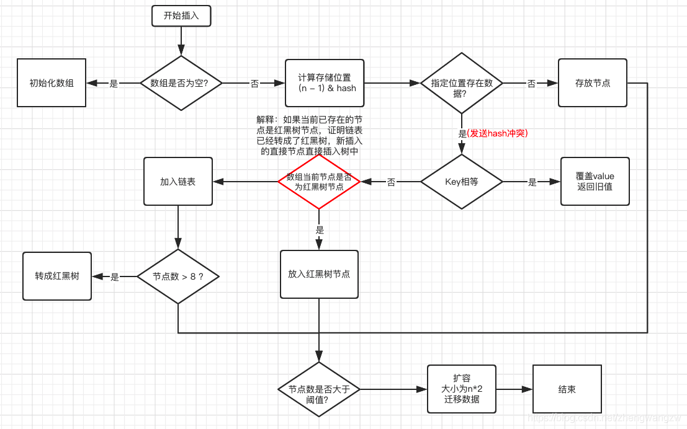
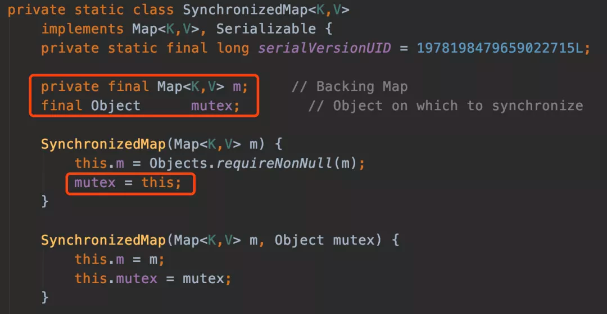

引用文章： 
    1.https://blog.csdn.net/zhengwangzw/article/details/104889549  
    2.https://mp.weixin.qq.com/s/0Gf2DzuzgEx0i3mHVvhKNQ

内部数据结构和数据结构之间的转换:
    
    数组中的每个节点存有：hash,key,value,next<Node>
    
    数据结构: 
        数组+链表+红黑树 key产生hash碰撞时，数组节点转变为链表;
        链表长度>8并且数组长度>=64，链表转变为红黑树； 红黑树节点<6，红黑树转变为链表;

put原理:
    

get原理:

扩容方式: 条件：容量*负载因子(0.75)
步骤: 1.创建新数组，长度为原来的2倍 2.rehash：遍历原数组数据重新hash到新数组 公式：index = HashCode（Key） & （Length - 1）;

1.8链表从头插改为尾插: 头插在多线程扩容时，会改变链表顺序，造成环形链表;

线程安全替代类: 
    1.HashTable:方法锁;
    2.CurrentHashMap: 对象锁，分段锁，多线程操作只会锁住当前操作索引的节点;
    
    3.Collections.syschronizedMap 排斥锁和方法锁;
    
    

如何解决hash冲突:
    1.开放地址法 hash后节点发生冲突，依次往后面的节点存数据; 
    2.链地址法 hashMap中使用的方法，当hash冲突后，在该节点转换为链表或红黑树;

