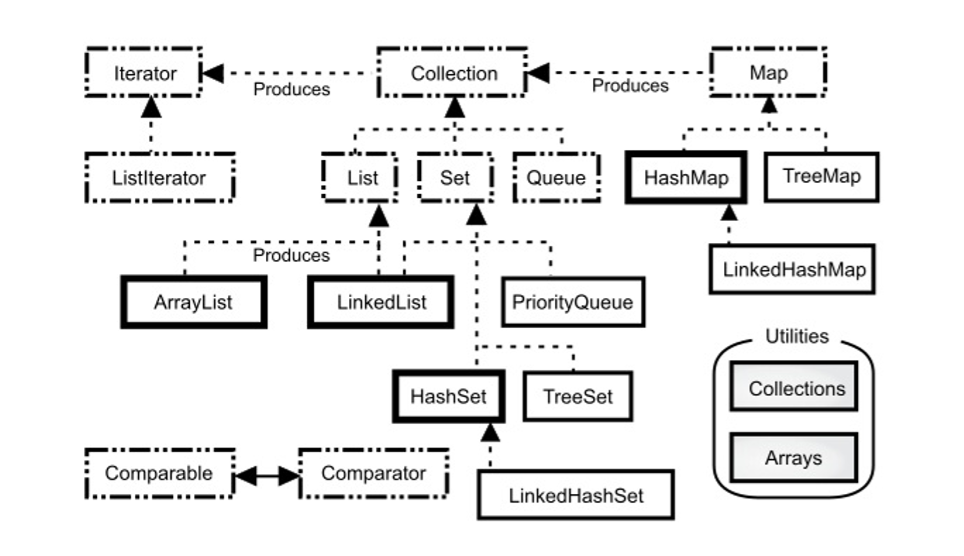
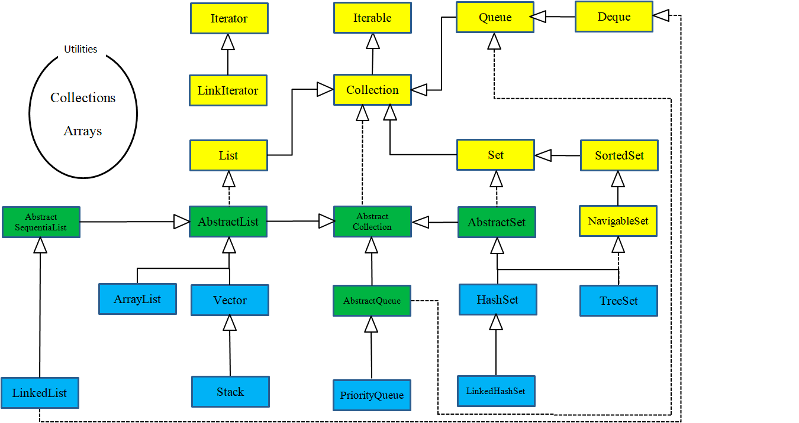
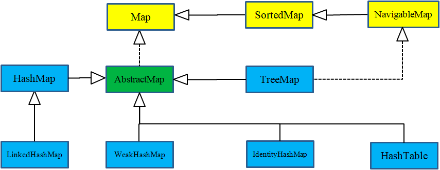

# 集合:
主要分四大块: Collection(List,Set,Queue),Map;

黄色:接口; 
绿色: 抽象类; 
蓝色: 具体类; 
实线箭头: 继承关系; 
虚线箭头: 实现关系;

## 集合打印时默认会打印所有元素: [a,b,c] or {a=b,c=d};

## Arrays.as(T t): 底层是数组，无法用集合里面的add，remove方法;

## ArrayList，LinkedList: 按插入数据排序;
ArrayList: 查找数据比较快;
LinkedList: 添加和删除数据比较快; 

## HashSet，TreeSet，LinkedHashSet: 数据不可重复;
HashSet(采用散列函数的数据结构): 查找数据比较快;
TreeSet(采用红黑树的数据结构): 如果存储顺序很重要，可以把数据按比较规则来排序。
比如按首字母排序，还可以往构造函数中传入比较器;
比较器: 建立排序顺序的对象;
LinkedHashSet(采用链表+散列函数的数据结构): 可以按照插入数据的先后数据排序;

## HashMap，TreeMap,LinkedHashMap: 按键值对存储数据;
HashMap: 查找数据比较快;
TreeMap: 如果存储顺序很重要，可以把所有的键按比较规则来排序，比如按Key的首字母排序;
LinkedHashMap: 在保持HashMap查找速度的同时按照键的插入顺序排序;

## Itrator(迭代器): 不必知道集合的确切类型，只能单向移动;
迭代器中主要方法:
1.iterator(): 返回集合的迭代器对象，并拿到集合第一个元素;
2.hasNext(): 检查集合中是否还有元素; 
3.next(): 返回集合中下一个元素;
4.remove(): 删除集合中最近返回的元素;

## 不要在新代码中使用遗留类: Vector，HashTable，Stack;

## Map和Collection之间唯一的交集是Map可以使用entrySet和values方法产生Collection;