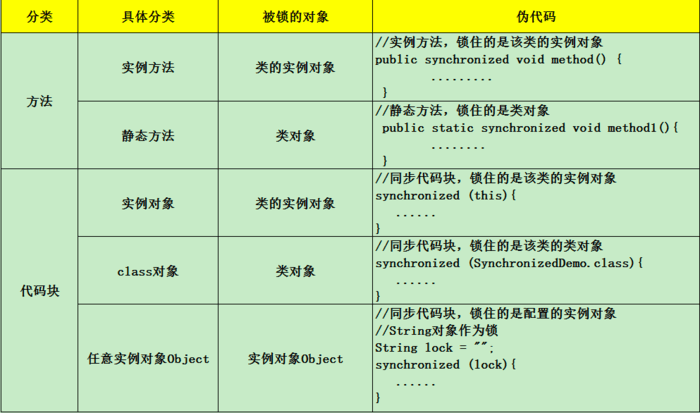

# synchronized关键字(悲观锁):
  
每个线程都有可能抢到不同的一把锁，必须保证抢到同一把锁(可重入锁，非公平锁(后来居上)，此时另一个线程会被阻塞)才能保证同步性;
内部锁的申请和释放对应的字节码指令是monitorenter和monitoexit，通过锁计数器计数，默认为0，获取一个计数器加一，释放一个锁计数去减一。
内部锁的实现相当于插入了内存屏障(执行monitorenter时插入加载屏障，执行monitorexit时插入存储屏障)，保证临界区中的指令不会跨越内存屏障;

## 语义规范:
1.进入同步块前，先清空工作内存中的共享变量，从主内存中重新加载;
2.解锁前必须把修改的共享变量同步到共享内存中;

## 如何做到保证线程安全:
1.锁机制保护共享资源，只有获得锁的线程才可操作共享资源;
2.语义规范保证修改共享资源后，会同步到工作内存;

## 1.6锁升级: 无锁->偏向锁->轻量级锁—>重量级锁;
    