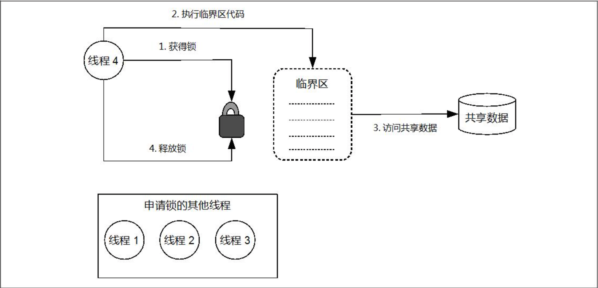

# 锁: 将多个线程对共享数据的访问转换为串行执行，一个共享数据一次只能被一个线程访问，该线程访问结束后其他线程才能对其访问;

## 具体锁:
1.synchronzied: 内部锁，非公平锁，可重入锁，互斥锁
锁升级：1.6之前统一采用重量级锁，1.6后按并发场景采用不同的锁，按顺序升级锁；
无锁-偏向锁-轻量级锁-重量级锁
偏向锁：只有一个线程访问的情况；
轻量级锁：多个线程争抢锁的情况，未争抢锁的线程采用自适应cas自旋操作；
重量级锁：
2.ReentrantLock: 显示锁，默认非公平锁(可以设置为公平锁和非公平锁)，可重入锁
    常用方法: lock,unlock,tryLock(尝试申请Lock实例锁表示的锁),isLocked,getQueueLength(检查锁的等待线程的数量)
3.ReentrantReadWriteLock: 读写锁，可重入锁;
    常用方法: readLock(返回读取操作的锁),writeLock(返回写入操作的锁)

## 临界区: 锁的持有线程在其获得锁和释放锁这段时间内执行的代码。临界区一次只能被一个线程访问;

# 锁分类:

锁: 互斥锁(又叫排他锁或者独占锁，一个锁一次只能被一个线程持有)和自旋锁属于基本锁，其他锁基于这两个锁实现;
互斥锁: 

读写锁(共享排他锁): 允许多个线程同时读取共享变量，但是一次只允许一个线程对一个变量进行更新;  
  
读写锁使用场景:
    1.只读操作比写操作要频繁的多;
    2.读线程持有锁的时间较长;
锁的降级: 一个线程持有读写锁的写锁的情况下可以继续获得相应的读锁;
锁的升级: 一个线程持有读写锁的读锁的情况下可以继续获得相应的写锁;

可重入锁: 一个线程在其持有一个锁的时候能再次申请此锁;

## 按锁的调度策略:
公平锁: 会按照排队顺序依次获取锁;
非公平锁: 多个线程获取同一把锁时，不会按照先后的排队顺序依次获取该锁，而是随机的;

## 按锁的实现方式:
内部锁(范围: 在一个方法内): synchronized关键字实现的，属于非公平锁;
显示锁(可以在多个方法中): 通过java.util.concurrent.locks.Lock接口的实现类实现，可以设置为公平锁和非公平锁;

## 按上锁时机:
悲观锁: 线程访问共享资源时，会先上锁;
    1.互斥锁;
    2.自旋锁;
    3.读写锁(写锁): 由读锁和写锁两部分构成;
        1.读优先锁;
        2.写优先锁;
        3.公平读写锁;
乐观锁: 先修改资源，再验证资源有没有发生冲突(其他线程有没有修改)。没有冲突，修改完成。有冲突，放弃修改。全程不会加锁;   

## 按互斥性:
独占锁: 一个线程获取锁时，其他线程不能获取锁;
    1.互斥锁;
    2.自旋锁;
    3.读写锁(写锁): 由读锁和写锁两部分构成;
        1.读优先锁;
        2.写优先锁;
        3.公平读写锁;
共享锁: 多个线程可以共享同一把锁;
    1.读写锁(读锁);