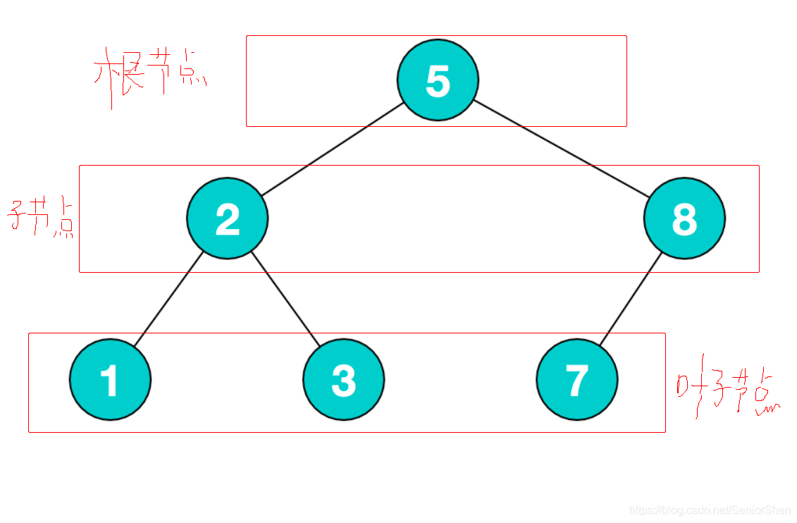
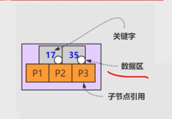
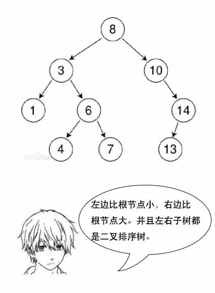
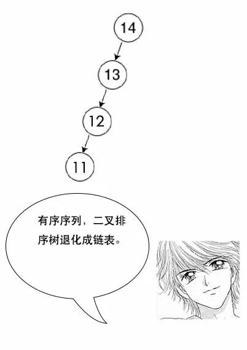
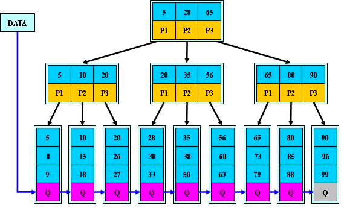
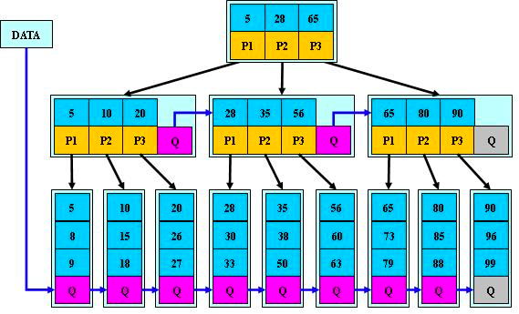

    ## 树形图: 
节点图：
引用文章: 
    1.图解二叉排序树，平衡树，红黑树，B树，B+树(https://blog.csdn.net/qq_29373285/article/details/88610654)    
    2.B树、B-树、B+树、B*树之间的关系(https://blog.csdn.net/u013411246/article/details/81088914?ops_request_misc=%257B%2522request%255Fid%2522%253A%2522161018502816780271522703%2522%252C%2522scm%2522%253A%252220140713.130102334..%2522%257D&request_id=161018502816780271522703&biz_id=0&utm_medium=distribute.pc_search_result.none-task-blog-2~all~baidu_landing_v2~default-2-81088914.pc_search_result_no_baidu_js&utm_term=b%E6%A0%91b-%E6%A0%91b+%E6%A0%91%E5%8C%BA%E5%88%AB&spm=1018.2226.3001.4187)
    3.红黑树变色和旋转(https://mp.weixin.qq.com/s/-8JFh5iLr88XA4AJ9mMf6g)

## 二叉搜索树或二叉排序树或二叉查找树:

1.所有非叶子节点最多有2个子节点; 
2.所有节点存储一个关键字;
3.非叶子节点左指针指向小于其关键字的子树，右指针指向大于其关键字的子树； 左边数据比跟节点小，右边数据比跟节点大。并且左右子树都是二叉排序树。
极端并发情况下，二叉排序树会退化成链表；

这种情况下需要用到平衡树，在插入的时候调整这棵树，让节点尽可能均匀分布;

## 红黑树：

二叉平衡树的一种，针对二叉搜索树的一种改进;
每个节点非黑即白； 根节点是黑的，叶子节点是黑的空节点; 
如果一个节点是红的，子节点都是黑的;
叶子节点到根节点不能有两个连续的红节点;
对于任意节点，它到叶子节点的每条线路都包含有相同数目的黑节点； 主要用于查找，插入和删除;

## 多叉搜索树或多叉排序树或多叉查找树:
根节点至少有2个子节点，子节点的数量<=树的层级;所有叶子节点位于同一层;

## B树或B-树:

每个节点都存放有关键字和数据，并且一个关键字存在且只存在一个节点中； 常用于磁盘读写，提高IO性能。数据和索引存在于磁盘，数据过大不能一次性加载进内存使用，可以每次加载一个节点然后一步步往下找;

## B+树:

B树的一种变种，为了提高查找效率; 非叶子节点只保存关键字和子节点引用，没有数据区，叶子节点通过双链表顺序连接，查找效率较高，数据区只存在叶子节点中。 相比于B树层级更少，查询数据更快。 常用于文件索引系统和数据库索引中;
数据批量查询时，B要做局部中序遍历，可能要跨层访问。B+树数据都存在叶子节点，不用跨层，只需要找到收尾通过链表查找所有数据;

