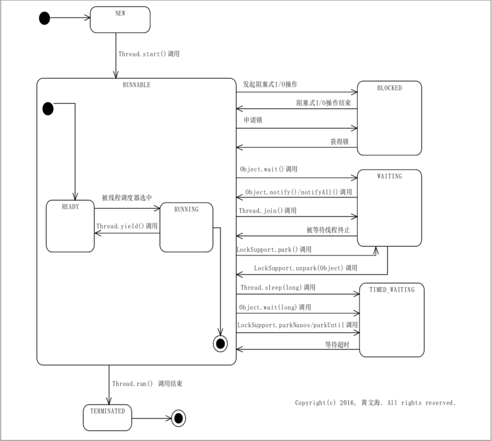
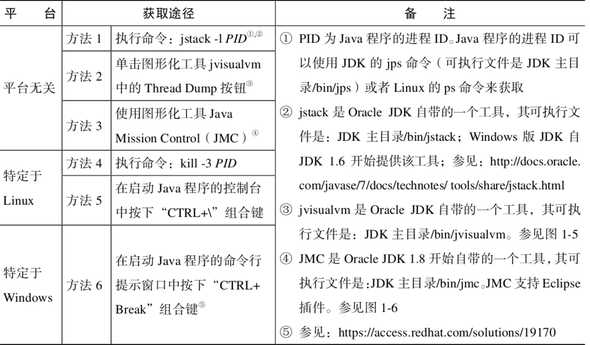

线程(处理任务的载体): 将进程分离成独立运行的任务，每个任务由一个线程来驱动;

线程属性: 除了编号，其他属性都可修改;
    编号: 线程编号，线程结束后当前编号可能会被其他线程使用，不能用编号作为唯一标识;
    名称: 默认值为(Pool-线程池编号 Thread-线程编号)。名称可以设置重复。;
    级别: 给线程调度器的提示。值为1-10，默认为5。默认值与父线程相同。高优先级的线程不一定在最前面执行;
    类别: 是否为守护线程。默认值与父线程级别相同。必须在start方法之前设置，否则会抛出异常。负责一些关键任务处理的线程不适合设置守护线程;

守护线程和非守护线程(用户线程): 守护线程用来监视其他线程执行情况，在用户线程执行之后结束。用户线程会阻止虚拟机运行(所有用户线程执行结束，虚拟机退出);

线程方法:
    静态方法:   
        Thread.currentThread(): 获取当前正在执行的线程对象;
        Thread.sleep(long): 当前线程进入TIME_WAITING状态。不会释放对象锁，在指定时间后进入RUNNABLE状态;
        Thread.yield(): 当前线程进入RUNNABLE的就绪状态。放弃cpu使用权，让相同优先级的线程重新竞争资源。不会导致阻塞。
        下面3个方法属于对象，不属于线程，只能用在synchronized同步块中。
        Object.wait()/wait(long): 当前线程进入WAITING状态。释放对象锁。依靠notify/notifyAll唤醒或者指定时间到就进入RANNABLE的就绪状态;
        Object.notify(): 不会让当前线程进入WAITING，会唤醒休眠的线程。
        Object.notifyAll(): 不会让当前线程进入WAITING，会唤醒所有被wait的线程。
        Thread.interrupted(): 
        Thread.setDefaultUncaughtExceptionHandler: 设置线程默认的异常捕获器;
    实例方法:
        interrupt(): 设置线程的中断标志位，可以根据标志位进行处理该线程;
        isInterrupt(): 
        join(long)/join(long): 进入WAITING/TIME_WAITING状态。不会释放对象锁。当前线程放弃cpu使用权，给调用join()方法的线程优先使用。 
                               等调用join方法的线程执行完后，当前线程进入RUNNABLE的就绪状态;    
        setDaemon: 设置为守护线程，需在start方法之前设置。当进程中不存在非守护线程时，守护线程自动销毁;
        isAlive(): 查看线程是否是RUNNABLE状态;
        start(): 进入RANNABLE状态。启动一个线程;
        run(): 调用start方法，获取cpu使用权之后执行;
        setPriority(int): 设置线程优先级(>=1，<=10，不在范围会抛出异常)。优先级高不一定最先执行，因为线程执行具有可变性;

线程6种状态:  
      
    1.NEW: 线程被创建，还没有执行start()方法;
    2.RUNNABLE(可运行): 可运行状态分两种情况，就绪(挂起)和运行中都称为可运行状态; 
        就绪(挂起):
            调用start()方法后:
            1.线程位于线程池中，等待被调度器选中(根据线程级别)获取cup的使用权，此时处于就绪(挂起)状态;
            2.处理网络资源时，因请求时间处于就绪(挂起)状态，需要获取到数据线程才处于运行中状态;
        运行中(调用run方法): 就绪状态的线程获取cpu使用权后就变为运行中状态;
    3.BLOCKED(阻塞): 线程正在等待一个monitor lock，没有竞争到锁;
    4.WAITING(等待): 线程已经拿到锁，需要等待其他线程做出一些特定动作(通知或中断);
        1.线程已经拿到锁，然后调用了wait方法，需要等待其他线程(锁拥有者)notify/notifyAll之后，才可以进行下一步操作;
        2.线程调用了join方法，需要等待被他join的线程执行结束;
        Object.wait();
        Object.join();
        LockSupport.park();
    5.TIME_WAITING(超时等待): 类似WAITING，只不过可以在指定时间内自行返回;
        Thread.sleep(long);
        Object.wait(long);
        Thread.join(long);
        LockSupport.parkNanos();
        LockSupport.ParkUntil();
    6.TERIMINATED: 线程终止;

线程组:

线程异常捕获: 线程运行中抛出的异常不能被捕获; 
    UncaughtExceptionHandler: 添加给每个线程对象，用于处理异常的接口。在创建线程池初始化的时候传入;
    Thread.setDefaultUncaughtExceptionHandler: 
        1.只有在每个线程没有设置异常处理器的时候，默认异常处理器才会工作

线程调度器: 属于操作系统的一部分;

线程转储(Thread Dump): 查看进程中运行的线程信息;    
      
    java visualvm适合在开发和测试环境监视进程中的线程情况。可以选中某个线程查看该线程的调用栈(需要安装Threads Inspector插件);

    
    

    