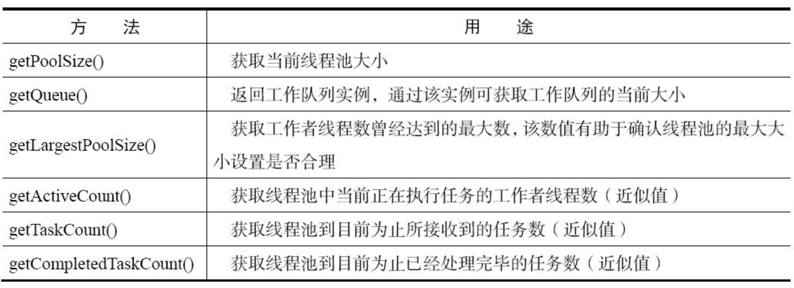
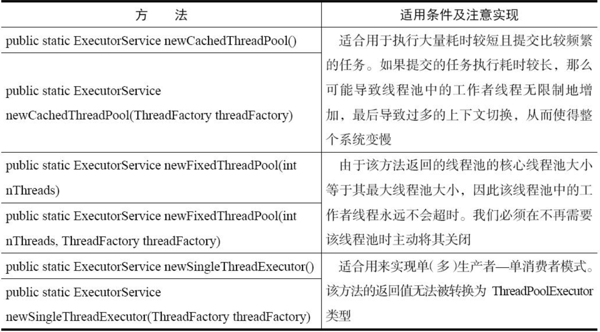

线程池: 内部预先创建一定数量的工作线程，客户端并不要向线程池借用线程，而是把执行的任务当做一个对象缓存在线程池的工作队列中。
线程池的工作线程会从工作队列中取出任务并执行。是基于生产者-消费者模式的一种服务;

线程的开销:
    1.线程创建，启动和销毁的开销。与普通的对象相比，线程还需要占用额外的空间-栈空间;
    2.线程调度的开销。导致上下文切换，增加处理器资源的消耗;    

ExecutorService: 线程池工具类

工作原理:
    初始状态下，客户端每提交一个任务，线程池就创建一个工作线程来处理。
    当当前线程池大小达到核心线程池大小时，新提交的任务会存入工作队列中，由所有工作线程处理。
    当工作队列满时，线程池继续创建工作线程，直到当前线程池大小达到最大线程池大小。

工作线程通过threadFactory.newThread创建。若没有指定线程工厂，则调用Executors.defaultThreadFactory创建;
当线程池饱和(即工作队列满并且最大线程池大小封顶)，客户端提交的任务会被拒绝。
为了提高线程池的可靠性，可以使用RejectedExecutionHandler接口中的方法rejectedExecution处理;

创建:
    0.ThreadPoolExecutor(标准线程池): 
    1.newSingleThreadPool: ExecutorService的一个实例。创建一个只有一个线程的线程池;
    2.newCacheThreadPool: 适合提交频率较高且耗时较短。根据内存大小创建线程数量，核心线程数为0，最大线程池大小为INTEGER.MAX_VALUE;
    3.newWorkStealingExecutor: 允许从其他队列中窃取工作项;
    4.newFixedThreadPool: 核心线程池数等于最大线程池数。
    5.newScheduledThreadPool

参数:
    int corePoolSize(核心线程池大小): 大于0,小于最大线程池大小;  
    int maximumPoolSize(最大线程池大小): 大于0;
    long keepAliveTime(空闲时间): 指当前线程池大小超过核心线程池大小的时候，空闲线程的最大存活时间;
    TimeUnit unit(): 
    BlockingQueue<Runnable> workQueue(工作队列的阻塞队列): 传输通道，用于缓存需要执行的任务;
    ThreadFactory threadFactory(): 指定创建工作线程的线程工厂;
    RejectedExecutionHandler(Runnable,ThreadPoolExecutor) handler(线程池饱和时执行的策略): 只对execute方法起作用。
        Runnable指被拒绝的任务，ThreadPoolExecutor指被拒绝任务的线程池实例对象。
        ThreadPoolExecutor提供的RejectedExecutionHandler: 默认为AbortPolicy类;  
        ThreadPoolExecutor中提供对RejectedExecutionHandler实现的的类:     
方法:
    1.submit(Runnable) return Future: 提交任务;
    2.execute: 执行新的任务;
    3.shutdown: 关闭线程池，停止提交任务;
    4.shutdownNow: 停止提交任务，并且中断当前已在运行的任务;
    5.isTerminated: 查看现场池中的线程是否处理完任务;
    6.invokeAll: 接收一个Collection;
    7.prestartAllCoreThreads: 使线程池在未收到任务的前提下预先创建并启动核心线程，使任务被执行时减少线程创建的等待时间;

Future: 提交给线程池执行任务的处理结果;
方法:
    get(long Timeout): 被调用时，如果相应的任务尚未执行完毕，那么get()会使当前线程暂停，直到相应的任务执行完毕;
    cannel(): 取消当前任务;
    isCancelled(): 返回相应的任务是否成功取消;
    isDone(): 检测相应的任务是否执行完毕;

Executors.callable(Runnable r,T result): Runnable转Callable;

线程池监控:  
      
钩子函数: beforeExecute,afterExecute。当任务被线程池中的工作者线程执行时触发;

线程池死锁: 同一个线程池只能用于执行相互独立的任务。彼此有依赖关系的任务需要提交给不同的线程池执行以规避死锁;

线程池工具类:  
      

异步任务: 延迟执行和周期性执行;
CompletionService: 默认实现类ExecutorCompletionService，一次性提交一批异步任务并获取这些任务的处理结果;
    获取批量提交任务的返回结果:take，为阻塞型  
                          poll: 非阻塞  
List<Futures> Executors.invokeAll(Collection<? extends Callable> tasks): 批量提交异步任务，只有全部任务都执行完才能返回;
    
    
