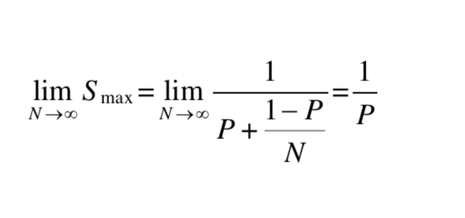
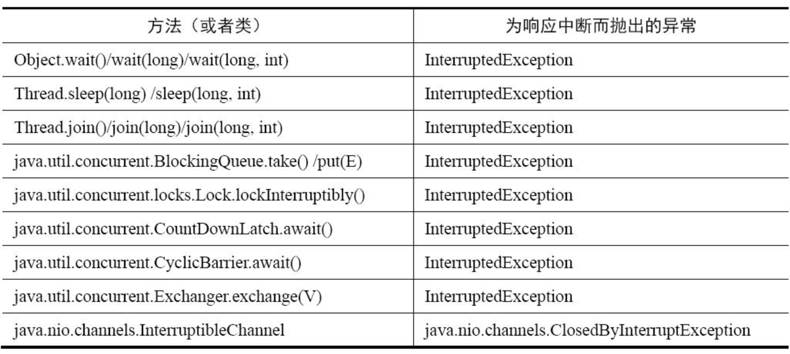
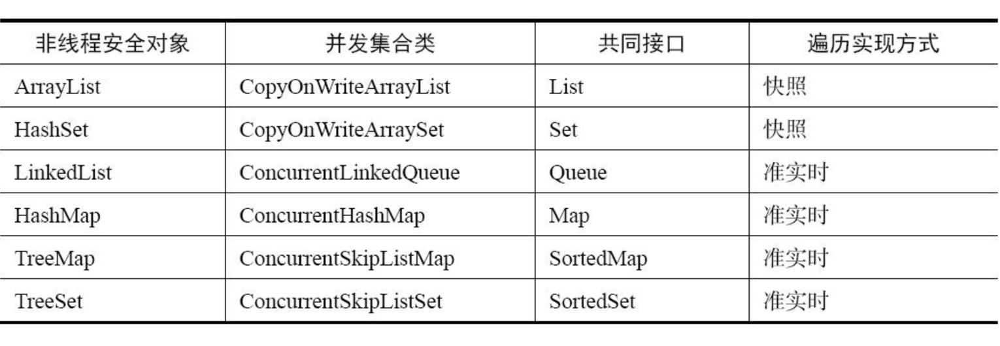
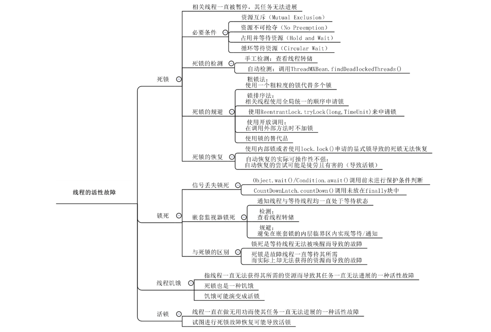

#并发:  

##并发三大问题:
原子性:
    一个原子操作是不能被线程调度机制中断的操作。一旦开始操作，那么一定可以在可能发生的上下文切换(切换到其他线程执行)之前执行完毕;
    实现原子性的两种操作: 锁机制和CAS;
可见性:    
    指一个线程对共享变量的更新结果，对于其他线程读取相应共享变量是否可见;
    父线程在启动子线程之前，对一个共享变量的更新对子线程是可见的;
    保证变量同步可见性:
    1.final;
    2.synchronized，Lock;
    3.volatile(happen-before，内存屏障);
有序性: 
    虚拟机为了优化字节码指令的执行效率，对指令进行了重排序。而重排序在并发访问时会引发竟态;    
    存在数据依赖关系的语句不会被重排序，即两个指令操作中其中一个指令为写指令;
    控制依赖语句指令也会被重排序，即if语句中的条件表达式和方法体;

##并发与并行的区别:  Java是通过线程实现并发和并行;
并发: 
    多个线程在同一段时间内交替(根据线程调度器分配给线程cpu使用权: 线程阻塞情况，线程优先级)处理多个任务;
并行:
    多个线程在同一段时间内同时处理多个任务。是并发的一个特例，并发的理想情况;
从处理器的角度来说: 一个处理器可以根据时间片分配的方式处理并发。并行则需要多个处理器各自运行一个线程;
同步和异步: 讨论的是顺序的问题;
Brian Goetz对并发和并行对定义:
    并发: 是关于正确有效的控制对共享资源的访问;
    并行: 是使用额外的资源来更快的产生结果;
理解并发，并行，串行最好的抽象例子: 车辆相当于线程，轨道相当于cpu使用权;
    串行好比多个车辆行驶在一条车道上(鱼贯前行)，相当于多个线程按顺序依次访问处理多个任务;
    并发好比多个车辆行驶在多条车道上(并驾齐驱)。它们可以交替使用各条车道，也可以在同一条车道鱼贯而行;
    并行的行驶情况是并驾齐驱，相当于多个线程在一段时间同时处理多个任务;
    

##线程与进程的区别:
线程: 是操作系统运行的最小执行单元。线程之间会存在共享内存资源;
进程: 是在其自己的地址空间中运行的独立程序。进程与进程之间是隔离的，相互不受干扰;

##Java内存模型: 定义共享变量的访问规则；
主内存(线程共享): 堆，方法区;
工作内存(线程私有): 虚拟机栈，本地方法栈，程序计数器;
1.共享变量必须存放在主内存中;
2.线程有自己的工作内存，只可操作自己的工作内存;
3.线程要操作共享变量，必须从主内存中通过同步协议读取到工作内存中，
  改变值后从工作内存通过同步协议同步到主内存;

##同步协议8中原子操作:
原子操作: 不会被线程调度机制打断的操作。这种操作一旦开始，就一直运行到结束，中间不会被切换到另一个线程;
1.lock(锁定): 将主内存中的变量锁定，为一个线程独占;
2.unlock(解锁): 将lock加的锁定解除，此时其他的线程可以有机会访问此变量;
3.read(读取): 作用于主内存变量，将主内存中的变量值读取到工作内存中;
4.load(载入): 作用于工作内存变量，将read读取的值保存到工作内存中的变量副本中;
5.use(使用): 作用于工作内存变量，将值传递给线程的代码执行引擎;
6.assign(赋值): 作用于工作内存变量，将执行引擎处理返回的值重新赋值给变量副本;
7.store(存储): 作用于工作内存变量，将变量副本的值传送到主内存中;
8.write(写入): 作用于主内存变量，将store传送过来的值写入到主内存的共享变量中;
同步协议:
1.将一个变量从主内存复制到工作内存要顺序执行read，load操作；
  将变量从工作内存同步回主内存要顺序执行store，write操作；
  只要求顺序执行，不要求连续执行;
2.做了assign操作，必须同步回主内存。不能没做assign操作，同步回主内存;

##CAS(Compare and Swap,比较替换,处理器中的一种指令): 乐观锁的一种实现，只能保证原子性，不能保证可见性;
预期值
目标值
替换值
CAS带来的ABA问题：通过AtomicStampedReference/AtomicMarkableReference解决ABA问题；

##竟态: 
多线程执行过程中，每一次执行结果可能不一样。竟态不一定导致结果每次都不正确。
竟态会使多线程在读取和修改同一个共享变量时，导致脏数据读取和覆盖更新。
是否会产生竟态决定程序是不是线程安全的;

循环不变表达式外提:

##上下文切换: RUNNABLE -> 非RUNNABLE(BLOCKED,WAITING,TIMED_WAITING) 之间的切换;
处理器从执行一个线程转向执行另外一个线程的时候，操作系统所需要做的一个工作。上下文操作是多线程执行的副产物，增加了系统的消耗;
一个线程因阻塞或者时间片到期而停止执行，把cpu使用权给其他线程执行的情况;
切换: 线程被剥夺cpu使用权而被暂停;
切入: 线程被线程调度器分配cpu使用权而开始执行;
按因素分类:
    自发性: wait,join,sleep,join,yied,LockSupport.park
    非自发性: 线程调度器根据线程优先级切换线程，GC回收时可能会暂停所有应用的线程;
上下文切换开销:
    直接开销: 操作系统保存和恢复上下文的时间开销，线程调度器进行线程调度的开销;
    间接开销: 重新切入的线程可能被一个没有运行过的处理器运行，需要重新读取共享数据;

##线程的活性障碍:
处于非RUNNABLE和RUNNABLE状态的线程一直停留在当前状态，无法进行下一个状态;
具体表现为死锁，活锁，锁死，饥饿(线程无法获取所需的资源，一直处于阻塞的情况);

##排他性资源: 一次只能被一个线程访问的资源，包括处理器，数据库连接，文件等;

##调度策略:
非公平策略: 吞吐量较大，缺点是资源申请者申请资源所需的时间偏差比较大，可能产生饥饿的情况;
公平策略: 
    为了维护公平策略，增加了切换上下文的次数(需要去暂停和唤醒线程)。
    吞吐量较小，适合于持有资源的线程占用资源时间较长，或者对资源申请所需的时间偏差较小。
    优点是线程申请资源所需的时间偏差较小，不会产生饥饿现象;

##static和final: 多线程访问的时候，能够保证变量已经初始化完;

##分治: 拆解任务，合并结果。将任务中只能串行和可以并发的部分区分开来，使用专门的线程去并发的处理那些可并发的部分。
使用方法主要有两种: 
    基于数据的分解: 从网络中下载一个大文件;
    基于任务的分解:
        1.按任务的资源消耗属性
            1.cpu密集型任务: 加密/解密;
            2.IO密集型任务: 文件读写，网络读写;
        2.按处理步骤

##合理设置线程数: 最终决定多线程提速的因素是整个计算过程中串行部分的耗时比率，应该从算法入手，减少程序中的串行部分;   
Amdahl's公式:   
线程数过小可能导致无法充分利用处理器资源。
线程数过大会增加上下文切换和其他小开。
cpu密集型线程数: 处理器数+1;
IO密集型线程数: 默认设置1个，不够用设置处理器数*2;

#并发工具类

##倒计时协调器(CountDownLatch): 可以让一个或者多个线程等待其他线程完成一组特定操作之后才继续执行;
通过countDown方法用来标记线程执行完的位置;
通过await方法阻塞其他线程执行，当计数器为0时唤醒其他线程;

##栏栅(CyclicBarrier): 让多个线程互相等待对方执行到代码中的某个地方，然后同时继续执行;
通过await方法控制显示锁和Condition让多个线程等待;

##信号量(Semaphore): 虚拟资源配额管理器。用来控制同一时间对共享资源的访问次数;
acquire: 申请配额;
release: 返还配额;
int availablePermits()：获取可用的许可证数量；
boolean hasQueuedThreads()：查询是否有线程等待获取许可证；

##交换器(Exchanger): 通过双缓冲实现数据生成和消费的并发。通过指定同步点，交换缓冲区;
双缓冲: 使用两个缓冲区，一个用来填充数据，一个用来消费数据;

##阻塞队列(生产者消费者模式中的共享资源): 从传输通道存入或者取出一个产品时，相应的线程因为传输通道中没有产品或者其存储空间已满而被阻塞;
按存储空间容量划分:
    有界队列: 由应用程序指定;
        ArrayBlockingQueue: 内部使用一个数组作为其存储空间，put和take操作使用的是同一个显示锁，会导致锁的争夺;
        支持非公平调度和公平调度;
        适合生产者线程和消费者线程并发程度较小的情况;
        LinkedBlockingQueue(既能实现有界队列也能实现无界队列): put和take操作使用的两把锁，初始化长度的时候需要使用原子类变量。
        只支持非公平调度;
        适合生产者线程和消费者线程并发程度较大的情况;
        SynchronousQueue: 生产者线程执行put时如果没有消费者线程执行take，那么生产者线程会被阻塞。反之亦然;
        支持非公平调度和公平调度;
        适合生产者线程和消费者线程并发程度差不多的情况;
    无界队列: 最大值为Integer.MAX_VALUE;

##线程间的直接输入和输出: 用来实现线程间的直接输入和输出。一个线程的输出可以作为另一个线程的输入;
PipedOutputStream和PipedInputStream适用于单生产者和单消费者; 

##线程中断机制: 一个线程请求另外一个线程停止其正在执行的操作;
Java平台会为每个线程维护一个中断标记的布尔型变量用于表示相应线程是否接收到了中断请求。
通过调用一个线程的interrupt设置线程的中断标志位为true。
目标线程可以通过Thread.currentThread.isInterrupted()查看标志位，也可以通过Thread.interrupted()重置标志位为false;
为响应中断而抛出的异常: 抛出前需要手动通过Thread.interrupted()重置标志位为false;  
  
    
##并发集合:     
并发集合的遍历方式:
    快照和准实时;

##线程的活性故障:  
  

死锁: 多个线程因相互等待对方而被永远阻塞(BLOCKING,WAITING)的情况。
通常是A拥有锁1的时候去申请锁2，B拥有锁2的时候去申请锁1。A只有在获得锁2的情况下才能释放锁1，B只有在获得锁1的情形下才能释放锁2。
两个线程各自都拥有对方申请锁的情况下去申请对方持有的锁;
必要条件: 
    互斥性：资源具有排他性，一个资源只能被一个线程独占；
    不可剥夺性：一个线程获取资源后，未使用完之前不能被其他线程使用；
    请求并等待：在线程已经获得资源后，试图去申请另一个资源的使用权，而此时另一个资源已经被其他线程占有。当前线程会处于请求阻塞状态，也不会
    释放已获取的资源；
    循环等待：多个线程拥有对方申请锁的情况下，去申请对方的持有锁；
规避死锁: 
    粗锁法: 将锁的粗细度提高。会降低并发度;
    根据ReentrantLock的tryLock指定超时时间，根据tryLock返回的结果来规避死锁;
    锁排序法: 使用全局统一的顺序申请锁;
    根据中断信号器;
死锁很难恢复(重启虚拟机)，只能尽量避免;

锁死: 线程一直处于等待状态无法被唤醒;
    1.信号丢失锁死: 没有相应的线程来唤醒等待现场而使等待线程一直处于等待状态的一种活性故障;
    2.嵌套监视器锁死: 等待线程在持有嵌套锁的情况下，内层锁wait后只能释放内层锁对象而不能释放外层锁对象，
    导致通知线程因使用嵌套锁时无法获取外层锁对象，进而无法唤醒内层锁对象;

饥饿: 在使用非公平锁时，一直没有被线程调度器分配到cpu使用权限，从而无法获取到锁对象执行任务;

活锁: 线程持有锁的情况下，任务一直不能结束;

##线程组: 包括多个线程和其他线程组。线程创建的时候没有指定线程组，默认为父线程所属线程组;
遗留问题太多，不考虑使用;

##线程异常捕获:
线程中抛出未被捕获的异常时，线程将提前终止。对于异常终止可以使用UncaughtExceptionHandler(Thread t,Throwable b)处理;
可以在线程启动前setUncaughtExceptionHandler;

##线程工厂: ThreadFactory(Thread newThread(Runnable r))

##FuturesTask: Runnable的实现类，可以用来表示Runnable或者Callable。无法多次提交，内部会维护一个运行状态，除非相应的任务是通过调用FutureTask.runAndReset执行;

##可重复执行的异步任务: AsyncTask;

##计划任务: 
ScheduledExecutorService: 默认实现类为ScheduledThreadPoolExecutor;

    
    

