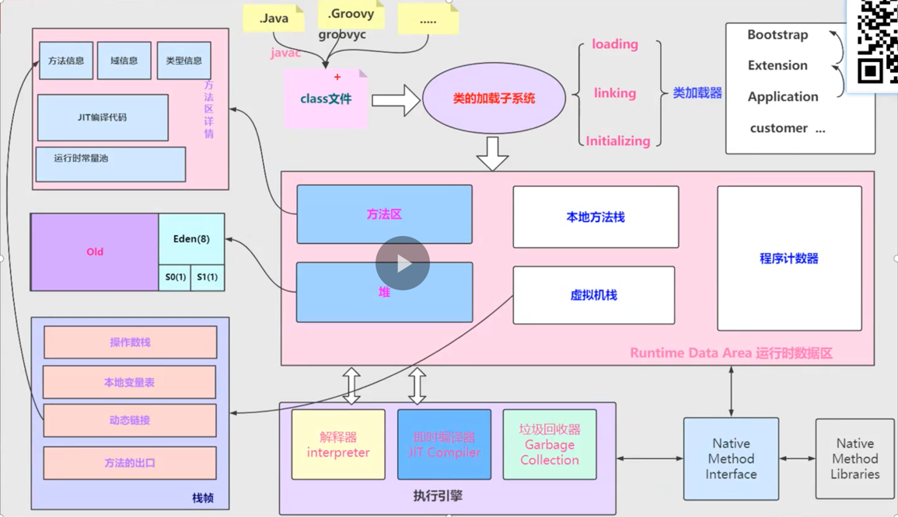
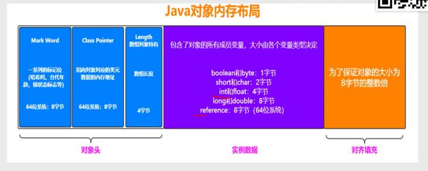
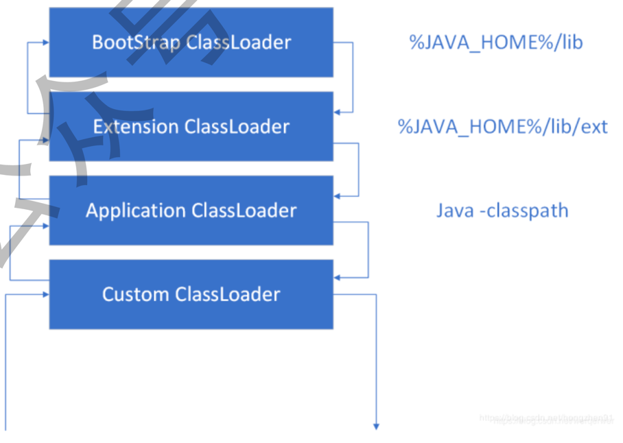
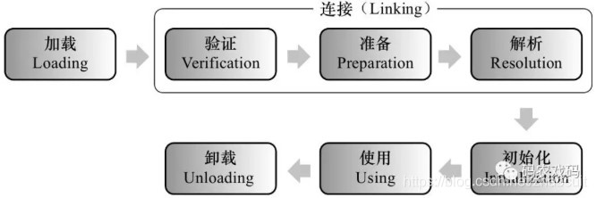
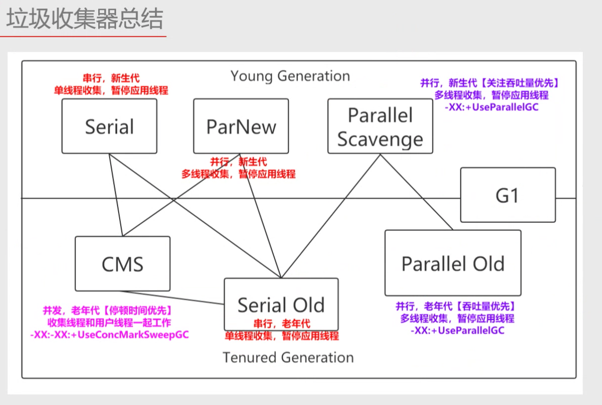
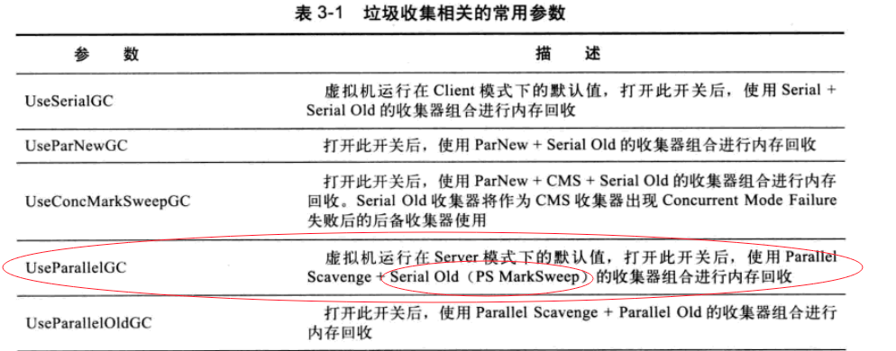
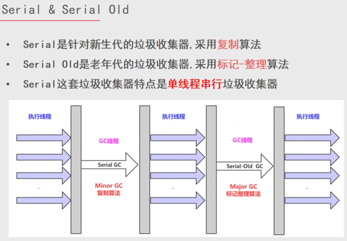
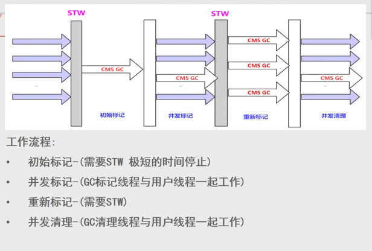
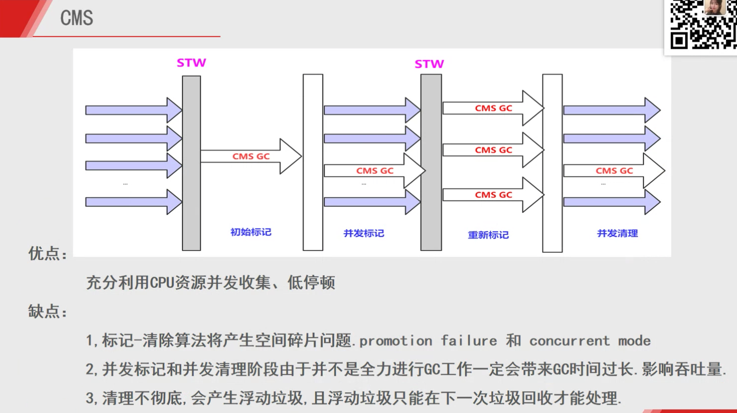

# JVM:
  

## 参考文档:
1.https://live.csdn.net/room/weixin_48013460/4YvQjPxO?utm_medium=distribute.pc_video_live.none-task-liveroom-csdn&depth_1-utm_source=distribute.pc_video_live.none-task-liveroom-csdn&spm=1016.2107.3001.4252

## JVM内存模型(运行区数据区): 定义共享变量的访问规则；  
数据区:
    1.堆(动态数据区): 类的实例对象，数组，字符串常量池，静态变量
    2.方法区(静态数据区):
        类型信息
            类(修饰符，继承信息，实现信息)，接口，注解，枚举
        方法信息(包括构造方法)
            名字，修饰符，返回值，入参
        域(字段)信息
            修饰符，类型
        运行时常量池
        JIT(即时编译器)编译后的热点代码
运算区:
    3.虚拟机栈(以栈桢的方式存储): 方法调用的顺序和执行过程，包括方法中的局部变量和运行时常量;
        栈桢:
            局部变量表
            操作数栈
            返回地址
            动态链接
    4.本地方法栈: 和虚拟机栈类似，管理的是本地方法;
    5.程序计数器: 保存当前线程执行字节码的行号;

## 对象组成结构:
  
对象头：第一部分存储对象自身的运行时数据：哈希吗、GC分代年龄、锁状态标识、线程持有的锁、偏向线程ID、偏向时间戳等；
    第二部分是指针类型：指向对象的类元数据类型(对象类型)；
    如果是数组，对象头中还有一部分用来记录数组；
实例数据：对象存储的有效信息，自定义的各种字段内容；
对齐填充：占位符的作用，规定必须为8字节的整数倍；

## 类加载机制：    
### 类加载器:    
Bootstrap加载器: 加载虚拟机自身运行所需的class;
ExtClassloader: 加载执行目录下一个特殊的class;
AppClassLoader: 加载classpath路径下的class，以及main函数所在类的class文件;

### 类加载器「双」（parents delegate：复数，表示委托给所有父加载器）亲委派: 通过ClassLoader类的loadclass方法；
加载时先检查是否被加载过，没有就递归父加载器加载，直到顶层的Bootstrap ClassLoad。父类加载器能够完成加载则成功返回，否则交给自己加载；
优点：避免类的重复加载、避免Java的核心API被篡改；

### 类加载过程(类的生命周期): 解析可能在初始化之后(运行时绑定);  
    
1.加载: 通过类加载器加载字节码进虚拟机;
2.验证: 确保被加载的类的正确性。验证文件格式、元数据、字节码、符号引用;
3.准备: 为类的静态变量分配内存，并将其赋为默认值。不包括常量，常量在编译时分配;
4.解析: 将常量池中的符号引用替换为直接引用(内存地址)的过程;
5.初始化: 为类的静态变量赋初始值(只有在第一次调用类的静态引用时才初始化);
6.使用: 初始化后才能使用;
7.卸载: 程序正常结束，OOM，System.exit(0)，异常。只有自定义加载器加载的类才能卸载;

### 垃圾回收(GC): 清理不使用的对象，回收内存；
堆的分代模型:  
      
    年轻代和老年代比例： 1:2；
    年轻代分为3个空间：Edan、Form Survivor、To Suvivor。比例为8:1:1；
    1.8的元空间替换1.7方法区的永久代，存在本地内存，通过MaxMateSpaceSize指定最大内存大小；
    Minor GC：清理年轻代。采用复制清除算法，从Edan到From Suvivor再到To Suvivor，循环15个周期，cms循环6个周期到老年代；
    Major GC：清理老年代，清理速度一般比Minor GC慢10倍以上。采用标记整理算法
    Full GC：清理整个堆空间，包括年轻代和老年代；

垃圾回收算法:
    标记清除算法：先标记所有可达对象，再清理没有标记的对象。造成堆内存碎片化，会让比较大的对象无法分配；
    复制清除算法：主要用在年轻代。把空间分两块，当一块用完时就将存活的对象复制到另一块，把已经使用过的一块清理。堆内存没有充分使用；
    标记整理算法（标记压缩算法）：先标记所有可达对象，未被标记的未垃圾对象。将所有存活的对象压缩到内存的一段，之内清理边界以为的内存；
    
###垃圾回收器:  
连线为年轻代和老年代搭配使用：    
  
  
串行回收器：   
    出现在1.3.1之前，分为Serial和Serial Old。通过单线程进行垃圾回收的时候必须暂停其他工作线程（STW：Stop The World），直到它收集完成；
    PS：Serial为新生代垃圾回收器，采用复制算法；Serial Old为老年代垃圾回收器，采用标记整理算法；
并行回收器：通过多线程进行垃圾回收，分为ParNew、Parallel ScaVenge和Parllel Old；
    ParNew为Serial的多线程版本；
    Parallel ScaVenge为1.8默认的新生代垃圾回收器，采用复制清除算法；
    Parallel ScaVenge内部包含PS MarkSweep来作为1.8默认的老年代垃圾回收器。
    PS MarkSweep垃圾回收器是以Serial Old收集器为模板设计，采用标记整理算法；
CMS「concurrent mark sweep」：
  

第一个实现并发垃圾收集的垃圾收集器。以最短的SWT停顿。可以和用户线程并发执行，会造成浮动垃圾，无法在当次集中处理，需要等待下次进行回收。采用标记清除算法；
G1「Garbage first」：1.9默认垃圾回收器。特点是保持高回收率的同时减少停顿，增大吞吐量。
取消按物理划分的年轻代和老年代，把回收区域分为一个个Region区，每一个Region基于运行时采用划分为年轻代、幸存者、老年代和存储巨型对象的分区；
整体采用标记清除算法，局部是采用复制清除算法。
ZGC：jdk15默认垃圾回收器；

如何判断对象可以被回收：
    引用计数：每个对象有一个引用计数属性，新增加1释放减1，为0时可以回收。无法解决相互循环引用的问题；
    可达性分析：通过GC Root（可达性算法的起点）找出所有可达（存活）对象，剩下没有被标记的对象就是需要清理的对象；

### GCRoot对象：
- 栈中的对象；
- 类的静态变量；
- 方法区中常量；
- synchronized；
- Thread对象；

## 执行引擎:
解释器: 解析字节码为机器码；
即时编译器: 将热点代码提前编译成机器码；
垃圾回收器: 回收不使用的对象；

## JVM参数设置：
-Xms： 设置堆的最小空间大小。
-Xmx： 设置堆的最大空间大小。
-XX:NewSize： 设置新生代最小空间大小。
-XX:MaxNewSize： 设置新生代最大空间大小。
-XX:PermSize： 设置永久代最小空间大小。
-XX:MaxPermSize： 设置永久代最大空间大小。
-Xss：设置每个线程的堆栈大小。
-XX:NewRatio=2：设置老年代/新生代的比例。

