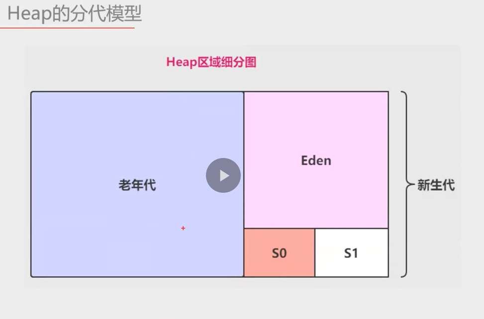

JVM:

参考文档:
1.https://live.csdn.net/room/weixin_48013460/4YvQjPxO?utm_medium=distribute.pc_video_live.none-task-liveroom-csdn&depth_1-utm_source=distribute.pc_video_live.none-task-liveroom-csdn&spm=1016.2107.3001.4252

JVM内存模型(运行区数据区):
数据区:
    1.堆(动态数据区): 类的实例对象，数组，字符串常量池，静态变量
    2.方法区(静态数据区):
        类型信息
            类(修饰符，继承信息，实现信息)，接口，注解，枚举
        方法信息(包括构造方法)
            名字，修饰符，返回值，入参
        域(字段)信息
            修饰符，类型
        运行时常量池
        JIT(即时编译器)编译后的热点代码
运算区:
    3.虚拟机栈(以栈桢的方式存储): 方法调用的顺序和执行过程，包括方法中的局部变量和运行时常量;
    4.本地方法栈: 和虚拟机栈类似，管理的是本地方法;
    5.程序计数器: 保存当前线程执行字节码的行号;
    
类加载器:
类加载器双亲委派:
类加载过程:
    1.加载;
    2.链接;
    3.初始化;

垃圾回收(GC):

堆的分代模型:

GC算法:
垃圾回收器:

执行引擎:
    解释器: 解析字节码为机器码;
    即时编译器: 将热点代码提前编译成机器码;
    垃圾回收器 

