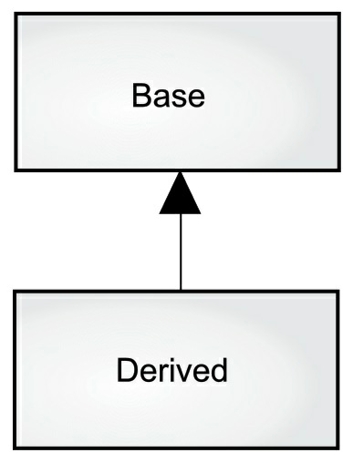
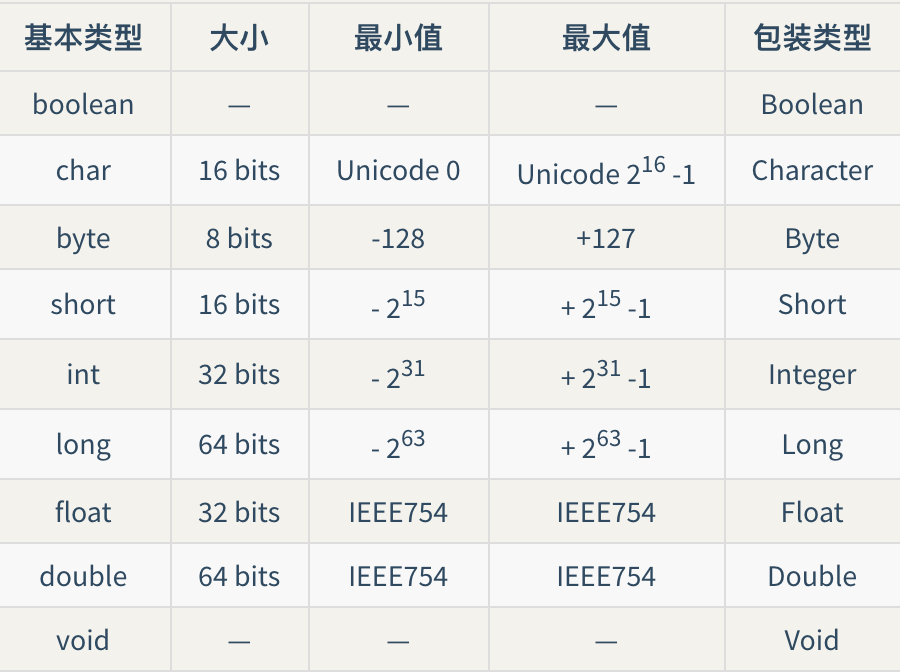

面向对象五大特征:
    1.万物皆对象;
    2.程序是一组对象，通过消息传递来告知彼此该做什么;
    3.每个对象都有自己的存储空间，可以容纳其他对象;
    4.每一个对象都有一种类型: 每个对象都是每个'类'的实例，其中'类(Class)'和'类型'(Type)是同义词;
    5.同一类所有对象都能接收相同消息;

复用:
    两个类生命周期不同步，则是聚合关系，生命周期同步则是组合关系;
    组合:
        整件拥有部件的生命周期，整件被删除时，部件一定会跟着删除，多个整件不可以同时共享一个部件;
    聚合:
        整件不会拥有部件的生命周期，整件被删除时，部件不会被删除，多个整件可以共享同一个部件;

继承:
    
    Base: 基类，超类，父类;
    Derived: 继承类，子类，派生类 ;
    继承中子类调用父类的方法用super，否则会产生递归调用;
    单继承结构: 
        1.使得垃圾收集器得实现更为容器;
        2.由于运行期的类型信息会存在于所有对象中，永远不会遇到判断不了对象类型的情况，例如异常处理;

基础类型:
    
    基本类型之间可以相互转换(Void除外);

高精度类型:
    用BigInteger和BigDecimal的方法而非运算符，来计算任意精度的整数和任意精度的定点数字(浮点数);

方法签名:
    方法名和参数列表统称为方法签名;

static变量:
    只占一份存储空间，多个对象会共享一个静态变量，只初始化一次;
    何时使用: 在new的时候或者调用静态变量和静态方法时;
    不能用于局部变量;

字面值常量:
    十六进制:
        由前导0x或0X表示，后续跟0-9或a-f(A-f);
    八进制:
        由前导0表示，后续跟0-7;
    二进制:
        由前导0b或0B表示;

类型提升:
    基本类型间执行任何运算，表达式中最大的数据类型是决定表达式结果的数据类型;

循环控制语句:
    1.break: 终止当前循环;
    2.continue: 终止本次循环，继续下次循环;
    3.continue 标签: 程序跳转至标签处，继续执行标签后面的循环;
    4.break 标签: 终止标签后面循环;
    5.return: 终止程序运行;

垃圾回收器:
    只回收new创建对象的内存;

成员变量和局部变量:
    类的成员变量声明时会有默认值;
    局部变量声明不会有默认值;

protected:
    作用域: 子类对象上，不能作用于父类对象;

final: 声明对象和方法参数时，引用不能改变;

空白final:
    定义: 没有初始化的final属性。编译器确保final在使用前必须初始化，这样既能使每一个对象的final属性值不同，也能保持它的不变性;

private方法:
    默认会加final修饰，子类无法重写该方法，但是可以创建同名的方法;

多态:
    动态绑定: 在运行时根据对象的类型进行绑定，在运行时判断对象的类型，方法调用机制调用恰当的方法;
    1.基类私有方法(默认为final)不能被重写，子类可以用@Override注解检测是否可以重写基类方法;
    2.向上转型时，基类属性不是多态的，父子类属性各自有一份存储空间;
    3.static方法也不是多态的;
    4.父类构造器尽量不调用调用子类方法，此时子类还没有初始化;

一个.java源文件中，可以有多个class。可以没有public修饰的class，最多只能有一个public修饰的class，且public修饰的class名必须与.java源文件名字相同;
    

    

    