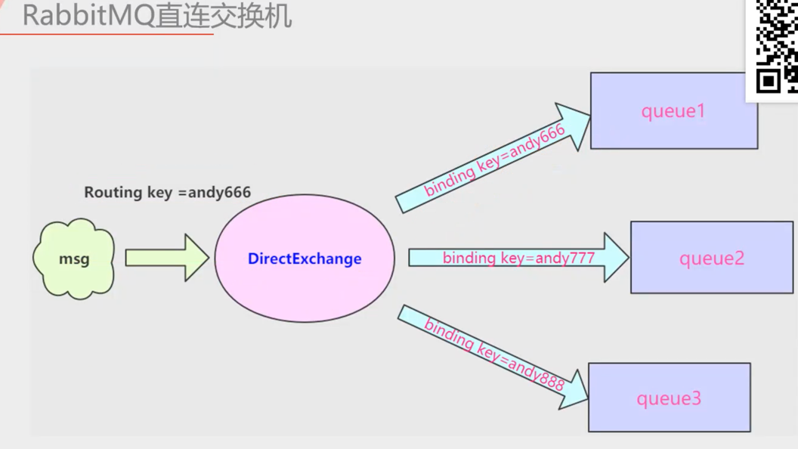
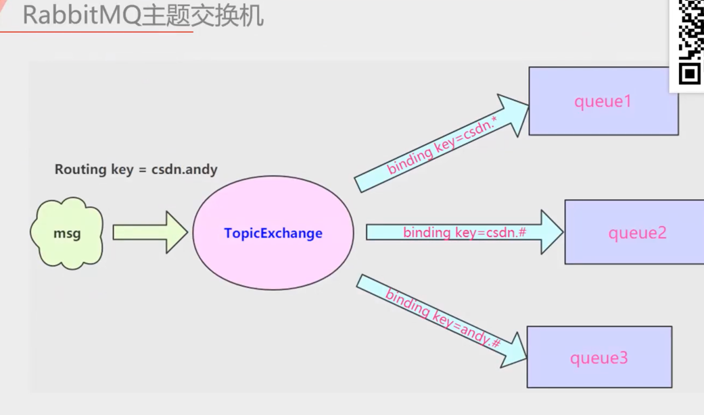
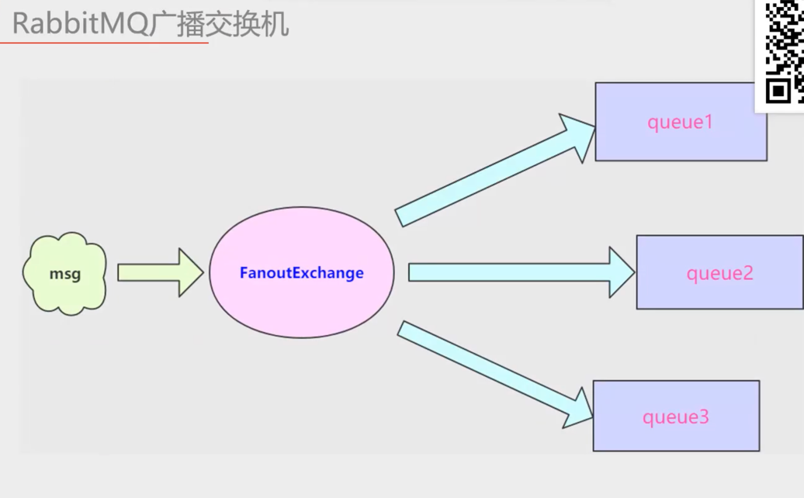
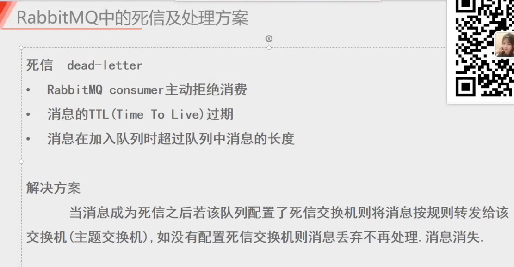
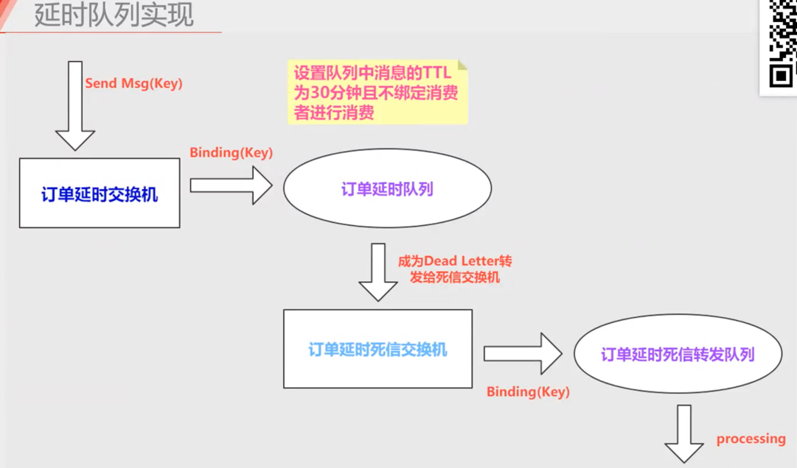
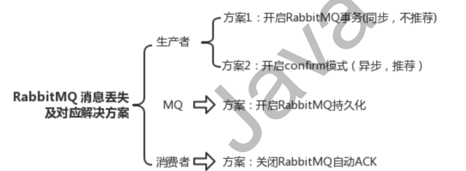

##RabbitMQ架构和核心组件

##Exchange：
直连交换机：routing key = binding key；

主题交换机：routing key like binding key。基于模式匹配，*（一个单词）号和#（零个或多个单词）号，如有多个队列匹配，会路由到多个队列；

广播交换机：无需指定routing key和binding key，会路由到绑定该交换机的全部队列；

##死信消息及处理方案
死信消息：没有被正常处理的消息；

##延时队列

##数据丢失问题：可能出现在生产者、MQ和消费者中；  

###生产者丢失：
1.MQ事务：发消息前开启事务channel.txSelect。如果MQ中没有接收到消息，生产会收到异常报错，此时生产者可以回滚事务，尝试重新发送消息。
如果接收到了MQ接收到了消息，生产者可以就可以提交事务。
2.Confirm机制：每次写消息都会分配一个唯一ID，如果成功写入MQ中，MQ会会场一个ack消息。如果MQ没能处理这个消息，会回调生产者一个nake接口，
告诉生产者这个消息接收失败，需要尝试重发；
两者区别：大部分情况使用Confirm机制。事务是同步的，Confirm机制是异步的，发完一个消息马上可以发送下个消息，不会发生阻塞；

###MQ丢失：
开启MQ的持久化，MQ挂了重启后会自动读取之前存储的数据。
创建持久化的两个步骤：
    1.创建queue的时候将其设置为持久化，这样可以保证MQ持久化queue的元数据，但是不会持久化queue的消息数据；
    2.发送消息的时候将消息的deliveryMode设置为2，将消息设置为持久化；
    必须同时设置这两种持久化
注意：消息写到了MQ中，还没来得及持久化时MQ挂了，会导致数据丢失；

###消费者丢失：
关闭MQ的自动ack，通过在程序中手动ack。MQ会把消息发给其他消费者去处理，消息不会丢失；

