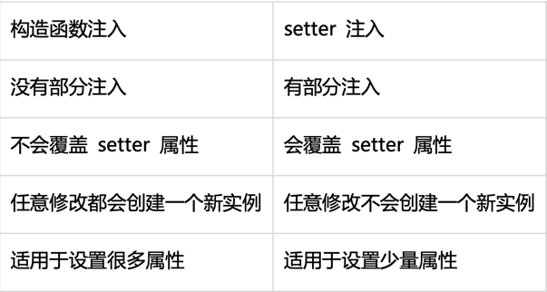
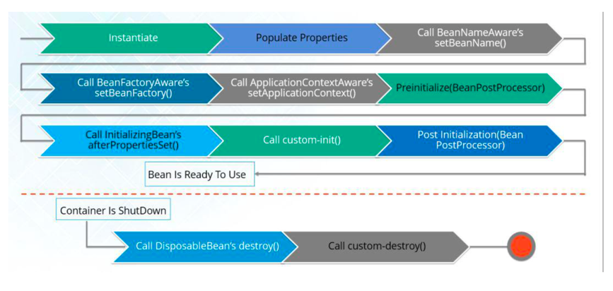
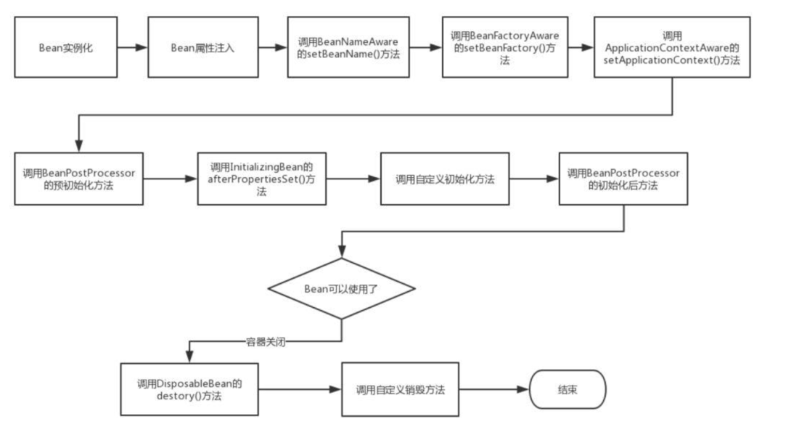

## IOC
IOC：控件反转，将手动创建对象的控制权反转交给Spring管理； DI：依赖注入，指在spring对象创建过程中，将对象属性通过配置注入到对象中；

## AOP：

## 区分构造函数注入和setter注入

## BeanFactory和ApplicationContext的区别：
BeanFactory采用延时加载，只在第一次getBean的时候才会初始化Bean。 
ApplicationContext接口是BeanFactory的子接口，会在启动加载配置文件时初始化Bean，可以为Bean设置lazy-init=true延时加载。
ApplicationContext提供了更多功能：
1.国际化（MessageSource）
2.访问资源，如URL和文件（ResourceLoader）：通过ClassPathXmlApplicationContext;
3.载入多个有继承关系的上下文，使得每一个上下文都专注于一个特定的层次，比如应用的web层；
4.消息发送，响应机制（ApplicationEventPublisher）：
    采用观察者模式，通过ApplicationContext发布ApplicationEven时，ApplicationListener将自动被触发；
5.AOP（拦截器）：
    一般拦截器都是实现HandlerInterceptor，有3个方法preHandler、postHandler、afterCompletion
    preHandler：执行Controller之前执行；
    postHandler：执行完Controller，return ModelAndView之前执行，主要操作ModelAndView的值；
    afterCompletion：执行完Controller之后执行；

## BeanFactory和FactoryBean的区别：
BeanFactory就是IOC容器或者对象工厂，所有的Bean都是由BeanFactory来管理的。而FactoryBean是一个能生产或装饰对象生成的工厂Bean；
BeanFactory定义了IOC容器最基本的形式，即提供了IOC容器应遵守的最基本的接口。BeanFactory本身只是个接口，提供了一些具体的实现，
如：DefaultListableBeanFactory、XmlBeanFactory、ApplicationContext；

## Bean的生命周期：

  
创建对象： 
1.Spring容器从xml配置的Bean、注解Bean中读取Bean的定义，实例化Bean； 
2.设置Bean的属性； 
3.注入Aware的依赖(BeanNameAware、BeanFactoryAware、ApplicationContextAware)；
4.执行前置Processor方法处理，BeanProcessor.postProcessorBeforeInitialization()； 
5.指定自定义Bean的init-method方法；
6.执行后置Processor方法处理，BeanProcessor.postProcessorAfterInitialization()；
使用对象
销毁对象： 
7.执行Disposable.destory()；
8.执行自定义Bean的destory方法；

## Spring中解决循环依赖：三级缓存；
singletonObjects：用于存放完全初始化好的bean，该缓存中取出的bean可以直接使用； 
earlySingletonObjects：提前曝光的单例对象的cache，存放原始的bean对象，用于解决循环依赖；
singletonFactories：单例对象工厂的cache，存放bean工厂对象，用于解决循环依赖；

## Spring事务管理
